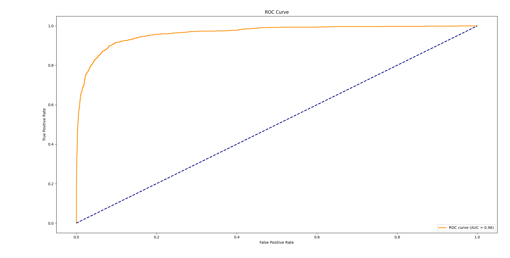
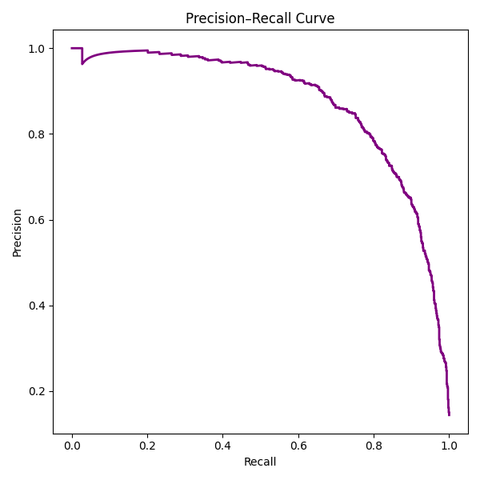
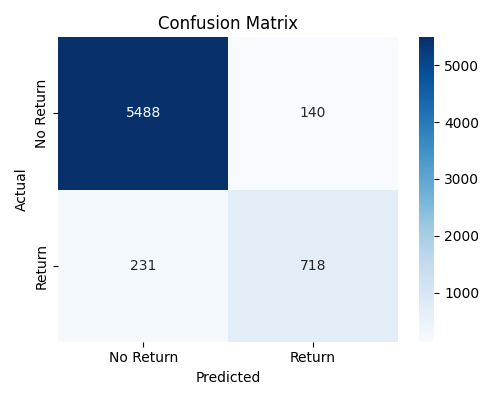
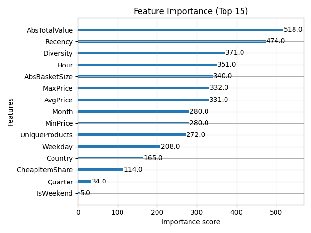

Problem: przewidywanie zwrotów zamówień (binary classification).

Dane: UCI Online Retail (2010-12 → 2011-12), ~500k linii. Link do źródła.

Original data comes from the **UCI ML Repository**:

- **Online Retail** dataset (Dec 2010 – Dec 2011 transactions):  
https://archive.ics.uci.edu/ml/datasets/Online+Retail  
Attribution-4.0 International (CC BY-4.0) license :contentReference[oaicite:1]{index=1}

EDA biznesowe: sprzedaż miesięczna/tygodniowa, zwroty per kraj, top produkty, RFM.

Podczas eksploracji zbioru Online Retail zidentyfikowałem kilka problemów jakościowych w danych:

1.InvoiceNo

Część faktur zaczyna się od litery C – oznaczają one faktury korekcyjne (zwroty).
Liczba takich faktur: X (≈ Y% wszystkich).

2.Quantity

Występują wartości ujemne, które odpowiadają zwróconym pozycjom.
Liczba rekordów z Quantity < 0: X.

3.UnitPrice

Znaleziono wartości równe 0 lub ujemne, co sugeruje błędy w danych lub wpisy testowe.
Liczba rekordów z UnitPrice <= 0: X.

4.CustomerID

Około X rekordów (~Y%) nie ma przypisanego identyfikatora klienta.
W analizie klientów takie rekordy należy traktować jako anonimowe lub pominąć.

5.Description

Część rekordów ma brakujące opisy produktów lub zawiera jedynie spacje.
Brakujące: X, puste: Y.
Można je uzupełnić placeholderem "(No description)".

BUISNESS EDA
1. Sprzedaż w czasie

Miesięczna sprzedaż: od grudnia 2010 do grudnia 2011 sprzedaż rosła, z wyraźnym pikiem w listopadzie 2011 (~1.46 mln £) – typowa sezonowość przedświąteczna.
Tygodniowa sprzedaż: potwierdza skok w tygodniach jesiennych i przed Bożym Narodzeniem.

2. Zwroty

% zwrotów miesięcznie: waha się w granicach 1.2–2.0% wszystkich transakcji.
Najniższy poziom w listopadzie 2011 (1.27%), najwyższy w styczniu/październiku (ok. 2%).
Kraje o największej zwrotności: USA (38%), Czechy (16%), Malta (12%), Japonia (10%).
→ ciekawe, że USA mocno odstaje od reszty.

3. Produkty

Top produkty sprzedaży:
PAPER CRAFT , LITTLE BIRDIE (80,995 szt.),
MEDIUM CERAMIC TOP STORAGE JAR (78,033),
WORLD WAR 2 GLIDERS (55,047).

Top produkty zwrotów:

te same produkty dominują (np. PAPER CRAFT , LITTLE BIRDIE: –80,995, JAR: –74,494),
czyli hity sprzedażowe są jednocześnie hitami zwrotów → ryzyko nadmiarowych zapasów.

4. Klienci (RFM)

Recency: większość klientów wraca co kilkadziesiąt dni, ale są i tacy, którzy nie wracają przez ponad 300 dni.

Frequency: większość kupuje 1–2 razy, mała grupa robi wiele zamówień.

Monetary: mediana ~kilkaset £, top klienci > 4000 £.

Segmentacja wg Monetary:

Low: 1457 klientów,

Medium: 1458 klientów,

High: 1457 klientów.
→ bardzo równy podział przy kwantylach, co fajnie wygląda w dashboardzie.

Wnioski z trenowania:

„Pierwsza wersja modelu dawała AUC≈1.0. Zdiagnozowałem data leakage: cechy oparte na znakowanej ilości/kwocie ujawniały zwrot. Zmieniłem definicję problemu na prognozę zwrotu w 30 dni po sprzedaży oraz przerobiłem cechy (absoluty / bez oryginalnych znaków). Wynik stał się realistyczny.”

„Podział czasowy zapewnia brak przecieku z przyszłości i lepiej symuluje wdrożenie.”

## Model Performance

### ROC Curve

### Precision–Recall Curve

### Confusion Matrix

### Feature Importance

