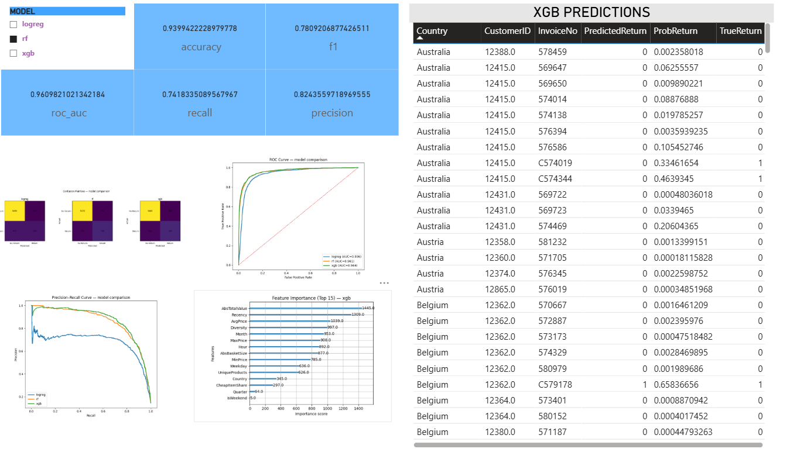

# UCI Online Retail — Returns Prediction (ML + Power BI)

Przewidywanie zwrotów zamówień (binary classification) na danych **UCI Online Retail** (2010-12 → 2011-12, ~500k rekordów).  
Pipeline end-to-end: **Data → Cleaning → EDA → Feature Engineering → Models → Reports → Power BI**.

## Spis treści
- [Jak uruchomić](#jak-uruchomić)
- [Konfiguracja (`config.yaml`)](#konfiguracja-configyaml)
- [Struktura projektu](#struktura-projektu)
- [Dane źródłowe](#dane-źródłowe)
- [Cleaning i Data Quality](#cleaning-i-data-quality)
- [Business EDA](#business-eda)
- [Modeling](#modeling)
- [Wyniki i wykresy](#wyniki-i-wykresy)
- [Dashboard Power BI](#dashboard-power-bi)
- [Wymagania](#wymagania)
- [Troubleshooting](#troubleshooting)

---

## Jak uruchomić

1. **Sklonuj repo i stwórz środowisko**
```bash
git clone <your-repo-url> UCI_online_retail_ml
cd UCI_online_retail_ml
python -m venv venv
# Windows:
venv\Scripts\activate
# Linux/Mac:
source venv/bin/activate
```

2. **Zainstaluj wymagania**
```bash
pip install -r requirements.txt
```

3. **Ustaw dane wejściowe**
- Umieść plik `Online Retail.xlsx` w folderze `inputs/`.
- (Opcjonalnie) Zmień ścieżki w `config.yaml`.

4. **Odpal pipeline**
```bash
python main.py
```

---

## Konfiguracja (`config.yaml`)

```yaml
paths:
  inputs: "inputs/Online Retail.xlsx"
  raw_csv: "outputs/online_retail.csv"
  clean_csv: "outputs/online_retail_clean.csv"
  metrics: "outputs/metrics.csv"
  predictions: "outputs/predictions.csv"

training:
  cutoff_date: "2011-10-01"
  models: ["logreg", "rf", "xgb"]

logreg:
  max_iter: 10000
  solver: "saga"
  penalty: "l2"
  class_weight: "balanced"

rf:
  n_estimators: 300
  max_depth: null
  random_state: 42

xgb:
  n_estimators: 300
  learning_rate: 0.07
  max_depth: 6
  subsample: 0.9
  colsample_bytree: 0.9
  random_state: 42
  tree_method: "hist"
  eval_metric: "logloss"
```

---

## Struktura projektu

```
UCI_online_retail_ml/
├── config.yaml
├── main.py
├── README.md
├── requirements.txt
├── .gitignore
├── db/
│   ├── schema.sql
│   ├── queries.sql
│   └── readme.md
├── EDA/
│   ├── __init__.py
│   ├── data_preparer.py
│   ├── eda_analisys.py
│   └── business_eda.py
├── ML/
│   ├── __init__.py
│   ├── agregation.py
│   ├── multi_model_trainer.py
│   └── visualizations.py
├── inputs/
│   └── Online Retail.xlsx
└── outputs/
    ├── online_retail.csv
    ├── online_retail_clean.csv
    ├── metrics.csv
    ├── predictions.csv
    ├── roc_models.png
    ├── pr_models.png
    ├── confusions.png
    └── feature_importance_xgb.png
```

---

## Dane źródłowe

- **UCI Machine Learning Repository – Online Retail**  
  https://archive.ics.uci.edu/ml/datasets/Online+Retail  
  Licencja: **Attribution 4.0 International (CC BY 4.0)**

---

## Cleaning i Data Quality

- **InvoiceNo**: faktury z `C` → korekty/zwroty (9288 rekordów)  
- **Quantity**: wartości ujemne → zwroty (10624 rekordów)  
- **UnitPrice**: wartości ≤ 0 → błędy/testy (2517 rekordów)  
- **CustomerID**: brakujące (~24.93%, 135080 rekordów)  
- **Description**: braki/puste (1454 rekordy)

Cleaning: usunięcie błędnych wartości, flaga `IsReturn`, uzupełnianie braków, dodanie `TotalPrice`.

---

## Business EDA

1. **Sprzedaż w czasie**  
   - Miesięczna: pik w listopadzie 2011 (~1.46 mln £).  
   - Tygodniowa: sezonowość przedświąteczna.  

2. **Zwroty**  
   - 1.2–2.0% miesięcznie, min. XI 2011 (1.27%).  
   - Najwyższe: USA, Czechy, Malta, Japonia.  

3. **Produkty**  
   - Najczęściej kupowane: *PAPER CRAFT , LITTLE BIRDIE*, *MEDIUM CERAMIC TOP STORAGE JAR*.  
   - Te same produkty dominują w zwrotach.  

4. **Klienci (RFM)**  
   - Recency: kilkadziesiąt dni, zdarzają się długie przerwy.  
   - Frequency: większość kupuje 1–2 razy.  
   - Monetary: mediana ~kilkaset £, top > 4000 £.  
   - Segmentacja Monetary: Low 1457 / Medium 1458 / High 1457.  

---

## Modeling

- Cel: przewidywanie zwrotu zamówienia.  
- Cechy: koszyk, ceny, czas, historia klienta, kraj.  
- Split: chronologiczny (cutoff 2011-10-01).  
- Modele: Logistic Regression, RandomForest, XGBoost.  

---

## Wyniki i wykresy

**Metryki (test set):**
```
| Model   | Accuracy | Precision | Recall | F1     | ROC-AUC |
|---------|----------|-----------|--------|--------|---------|
| xgb     | 0.9439   | 0.8311    | 0.7671 | 0.7978 | 0.9636  |
| rf      | 0.9399   | 0.8244    | 0.7418 | 0.7809 | 0.9610  |
| logreg  | 0.9024   | 0.7380    | 0.5016 | 0.5972 | 0.9356  |
```

**Wizualizacje (`outputs/`):**
- ROC Curve: `roc_models.png`  
- Precision–Recall Curve: `pr_models.png`  
- Confusion Matrices: `confusions.png`  
- Feature Importance (XGB): `feature_importance_xgb.png`

---

## Dashboard Power BI

Plik: `dashboards/Returns.pbix` (dane z `outputs/`).




---

## Wymagania

```
pandas
numpy
scikit-learn
xgboost
matplotlib
seaborn
pyyaml
```

---

## Troubleshooting

- **LogisticRegression convergence** – użyto `solver="saga"`, `max_iter=10000`.  
- **ImportError** – uruchamiaj z katalogu projektu: `python main.py`.  
- **Za dużo plików w outputs/** – usuń ręcznie lub napisz skrypt czyszczący.  
- **Zwroty per kraj** – filtruj kraje z małą liczbą zamówień, aby wyniki były stabilne.  
